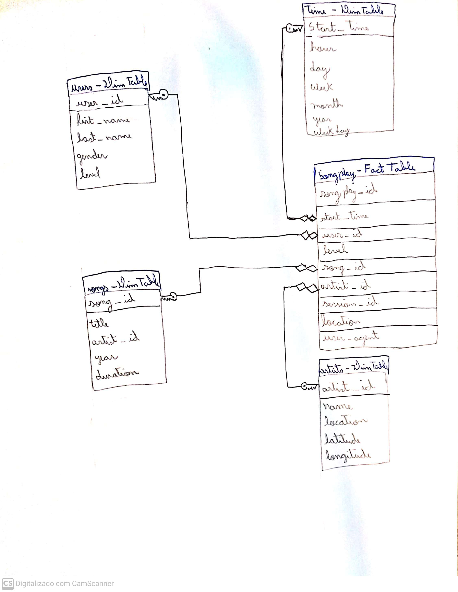

# Data Lakes with Spark and AWS S3
## Udacity Data Engineering Nanodegree

### Project Context
- The purpose of this project is to extract **songs** and **user logs** data from **AWS s3** from a music app called **Sparkify**, transform this data into a meaningful dimensional model with facts and dimensions on a Star Schema, and them load this data back into **AWS S3** in **parquet** format.  

### Solution Description
- In order to best fit the needs of the startup, 5 new tables were build with PostgresSQL with a [**Star Schema**](https://en.wikipedia.org/wiki/Star_schema), as follows the image:  
  
- The **songplay** is the [**Fact Table**](https://en.wikipedia.org/wiki/Fact_table#:~:text=In%20data%20warehousing%2C%20a%20fact,schema%20surrounded%20by%20dimension%20tables.) of the Star Schema, which will be used to quickly retrieve information about users activity on the app, while the [**Dimension Tables**](<https://en.wikipedia.org/wiki/Dimension_(data_warehouse)>) **users, time, songs and artists** can be used to retreive the detailed information of entities present in the **songplay** table.
- The raw data, **songs** and **user logs** are in **JSON** format on the **/raw** partition on **AWS S3**, and the resulting processed tables will reside on **/processed** on **AWS S3**.
- The Storage Layer of this project will be **AWS S3**, and the Processing Layer will be a **Spark Cluster with PySpark**, the **Spark Cluster** will load raw data from **AWS S3**, process and create all 5 tables, than load the tables in parquet format back in **AWS S3**.

### Steps to reproduce the solution:
- First of all, we need to configure and create our EMR Cluster
  1) Congigure a **bootstrap.sh** file and alocate it in s3, so you EMR cluster can load and install some packages on start: https://docs.aws.amazon.com/emr/latest/ManagementGuide/emr-plan-bootstrap.html. Read the `bootstrap.sh` file on this repo to see an example, read this article to understand how to install packages after creating the cluster: https://aws.amazon.com/blogs/big-data/install-python-libraries-on-a-running-cluster-with-emr-notebooks/.
  2) After that, read the `create_emr.sh.example` file to see how you should create your own `create_emr.sh` file. Then, create your EMR cluster running the script: `$ source create_emr.sh`
  3) After creating the cluster, we need to allow SSH connection to the master node, so we can copy the `etl.py` script to the master node and submit it:
    - First you need to allw SSH to the master node: https://docs.aws.amazon.com/emr/latest/ManagementGuide/emr-connect-ssh-prereqs.html. You will need to edit an Inbout rule.
    - SSH to your master node * `$ ssh -i PATH_TO_MY_KEY_PAIR_FILE.pem haddop@MASTER_PUBLIC_DNS`
    3.3) Once inside the master node, change the Pyspark Defaults to run Python3: `$ sudo sed -i -e '$a\export PYSPARK_PYTHON=/usr/bin/python3' /etc/spark/conf/spark-env.sh`
    - Copy the etl script to your master node: `$ scp -i <PEM_KEY> etl.py hadoop@<MASTER_PUBLIC_DNV>:~/`
    - Execute it: `$ spark-submit etl.py`
4) Now check your bucket partition with processed data and check if the tables were created. Mine were created at **s3://udacity-de-files/processed**.
